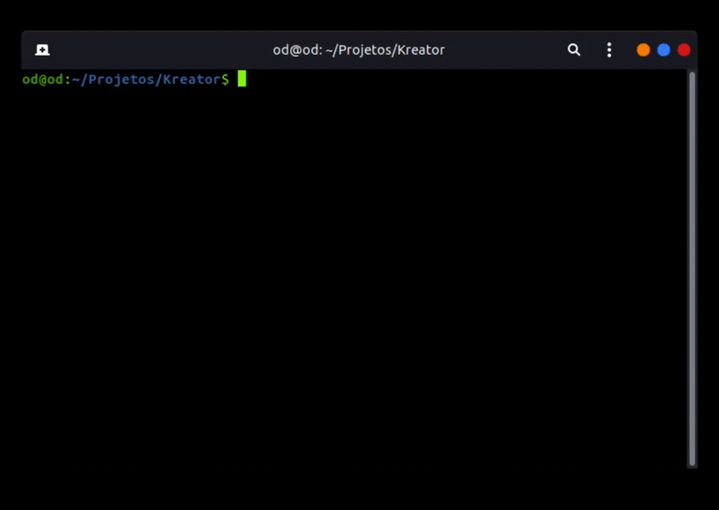

# Kreator
Kreator é um programa que dado certas informações sobre alguém, te entrega uma wordlist com as mais prováveis senhas do indivíduo.

## Instalação
Para rodar o programa são necessários certos passos. Que dependem do sistema do usuário.  

**Windows**:  

Baixe o instalador por [aqui](https://github.com/OdZarref/Kreator/raw/master/versions/kreator%20v1.0.exe) ou a versão Portable por [aqui](https://github.com/OdZarref/Kreator/raw/master/versions/kreator%20v1.0%20portable.zip).

obs: Execute em modo administrador para que o programa consiga escrever as senhas.

**Windows pelo código fonte**

Instale o Python:  
https://www.python.org/downloads/

Instale o git:  
https://git-scm.com/downloads

Abra o cmd ou Powershell e clone o repositório localmente:  

`git clone https://github.com/Odzarref/Kreator`

Com o cmd ou Powershell na pasta do projeto clonado escreva:  

`python kreator.py`

**Linux (distribuições baseadas em debian)**:  

É necessário ter o git instalado, caso não tenha:  

`sudo apt install git`  

Abra o terminal e clone o repositório localmente:  

`git clone https://github.com/Odzarref/Kreator`

Com terminal no diretório do repositório clonado digite:  

`python3 kreator.py`

## Como usar
Coloque as informações que são pedidas pelo programa, estas são:

**Nome completo**: Aceita o nome junto com os sobrenomes, apenas o nome e nenhum dado.  
obs: Caso nenhum nome seja dado, o arquivo com as senhas receberá "passwords.txt". Caso sim, o arquivo receberá o nome dado.  

**Data de nascimento**: O nascimento ou nenhum dado.  
obs: Deve ser numérico com a extensão de 8 caracteres e no formato dd/mm/aaaa. exemplo: 17031999

**Apelido**: Aceita um, mais de um ou nenhum.  
obs: Caso o apelido contenha mais de uma palavra, o escreva junto (sem espaços). exemplo: odzarref.  
Quando mais de um apelido, utilize um espaço para separá-los. exemplo: od zarref

**Onde as senhas são escritas**: São escritas no diretório do programa. O nome do arquivo pode variar de acordo com os dados que o usuário passar. Se as senhas não estiverem sendo escritas, e você está usando a versão instalada no windows, execute o programa em modo administrador.

## Métodos
Existem dois métodos que podem ser escolhidos "probability" e "permutation".

**Probability**: Este é o método mais simples que irá gerar uma wordlist mais seleta. Com as senhas que mais provavelmente estarão certas. O que ocasiona em uma menor quantidade de senhas. É o método para ocasiões em que não é possível ter infinitas tentativas, onde há bloqueio de tentativas por hora e etc.

**Permutation**: Neste caso, o programa pegará todos os argumentos de nome completo e apelidos e transformará em uma lista, e com esta, gerará todas as combinações e todas as permutações de cada combinação. Aqui é há uma menor precisão em cada senha gerada, já que os argumentos serão combinados uns com os outros sem nenhum critério. É recomendado para casos sem bloqueio de tentativas, pois gerará uma enorme quantidade de senhas.
obs: Quanto mais apelidos, nomes e sobrenomes o usuário dar para o programa, facilmente é possível chegar a milhões de senhas.

## Progresso
* [X] Criação do projeto
* [X] Leitura e escritura de senhas baseadas em nome completo, data de nascimento e apelidos.
* [X] Interface gráfica.
* [X] Opção de escritura de todas as combinações possíveis de senhas dos dados recebidos.
* [X] Executável para windows.
* [ ] Ordenação das senhas pelas mais prováveis primeiro.
* [ ] Leitura e escritura de senhas baseadas em país e informações adicionais.