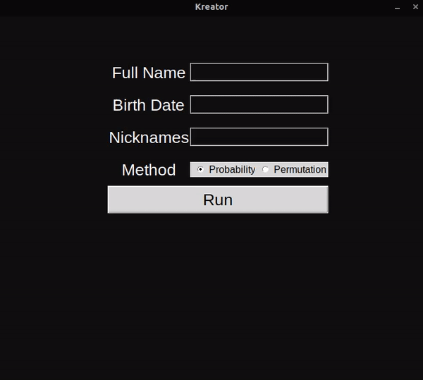

# Kreator
Kreator é um programa que dado certas informações sobre alguém, te entrega uma wordlist com as mais prováveis senhas do indivíduo.

## Instalação
Para rodar o programa são necessários certos passos. Que dependem do sistema do usuário.  

**Linux (distribuições baseadas em debian)**:  

É necessário ter o git instalado, caso não tenha:  

`sudo apt install git`  

Abra o terminal e clone o repositório localmente:  

`git clone https://github.com/Odzarref/Kreator`

Com terminal no diretório do repositório clonado digite:  

`python3 kreator.py`

**Windows**:  

Instale o Python:  
https://www.python.org/downloads/

Instale o git:  
https://git-scm.com/downloads

Abra o cmd ou Powershell e clone o repositório localmente:  

`git clone https://github.com/Odzarref/Kreator`

Com o cmd ou Powershell na pasta do projeto clonado escreva:  

`python kreator.py`

## Como usar
Coloque as informações pedidas pelo programa, estas são:

**Nome completo**: Aceita o nome junto com os sobrenomes, apenas o nome e nenhum dado (enter).  
obs: Caso nenhum nome seja dado, o arquivo com as senhas receberá "passwords.txt". Caso sim, o arquivo receberá o nome dado.  

**Data de nascimento**: O nascimento ou nenhum dado (enter).  
obs: Deve ser numérico com a extensão de 8 caracteres e no formato dd/mm/aaaa. exemplo: 17031999

**Apelido**: Aceita um, mais de um ou nenhum (enter).  
obs: Caso o apelido contenha mais de uma palavra, o escreva junto (sem espaços). exemplo: odzarref.  
Quando mais de um apelido, utilize um espaço para separá-los. exemplo: od zarref

## Progresso
* [X] Criação do projeto
* [X] Leitura e escritura de senhas baseadas em nome completo, data de nascimento e apelidos.
* [ ] Ordenação das senhas pelas mais prováveis primeiro.
* [ ] Leitura e escritura de senhas baseadas em país e informações adicionais.
* [ ] Opção de escritura de todas as combinações possíveis de senhas